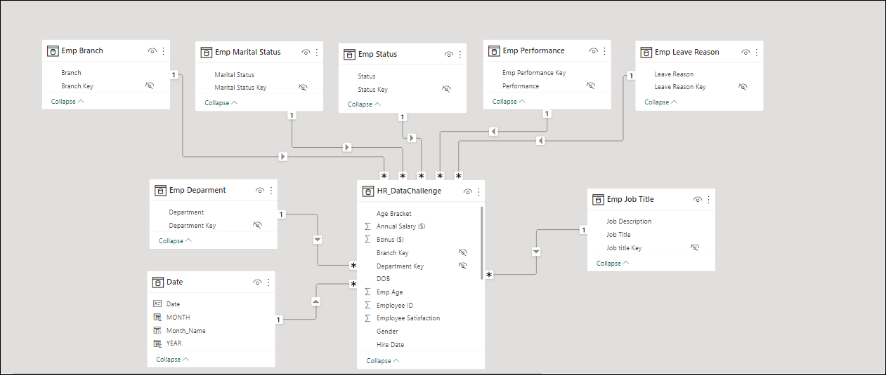
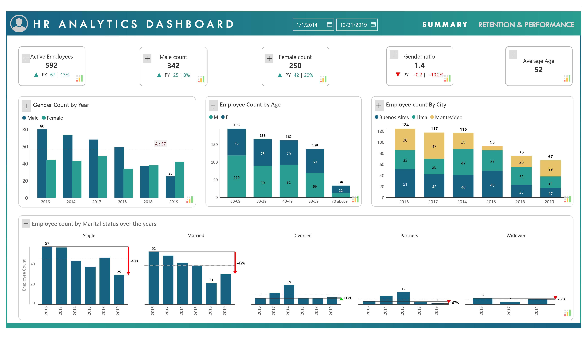
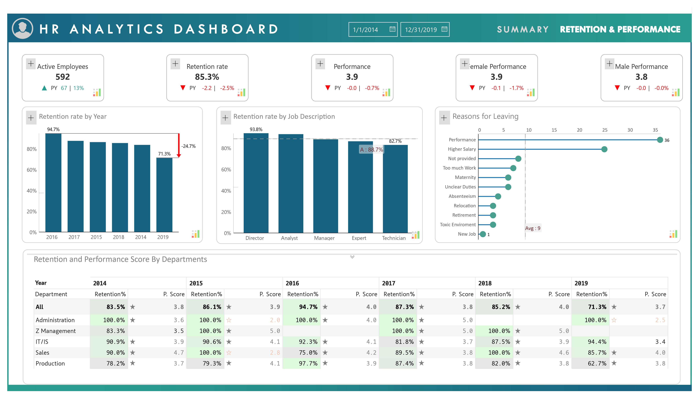

# Inforiver's Human Resource Dashboard

**FP20 Challenges - April 2023 - Challenge 4**

## Introduction
Inforiver drives business productivity and business performance with faster time to insights inside Power BI through an intuitive no-code experience.
FP20 Analytics Challenges is well known in the data community to run data challenges supporting over thousands of participants to practice reporting development.
Inforiver and FP20 Analytics Challenges collaborate to present a HR DEI data challenge to address our significant social impacts in the organization.

This role is that of a HR data analyst to develop a HR Dashboard for the organization. The organization has purchased Inforiver as its primary custom visuals to standardize
and simplify the reporting.

## Skills demonstrated
- DAX
- Page Navigation
- Filters and Slicers
- Inforiver Visuals and visualizations
- KPI representations

## Problem Statement
The organization is expecting a report with no more than 2 pages answering the following questions
- Can you find the age segments about the employees?
- What is the gender ratio each hire year?
- What is the martial status distributed each hire year? Did number of single new hires increase or decrease historically?
- What branch had the most/fewest new hires each year?
- How about the employee retention rate each year? What is the main leave reason?
- Which department had the most/fewest new hires each year?
- Which department had the highest/lowest retention rate each year?

## Data Sourcing
There is 1 DEI dataset and 1 PBIX file.
- An Excel spreadsheet.
- PBIX file with Inforiver installed.

The excel spread sheet consists of 21 columns and 695 rows of data.
The PBIX file already has the spreadsheet loaded in and transformed into 8 tables for ease of modelling.
- Emp Branch table
- Emp Department Table
- Emp Job Title Table
- Emp Leave reason Table
- Emp Marital Status Table
- Emp Performance Table
- Emp Status Table
- Hr_Datachallenge (The Fact table)

A Date table was created using DAX. The table is named Date Table

## Modelling.
The Different tables listed above were modelled as shown below:

## Analysis and Visualization.
This is the image of the Dashboard made

